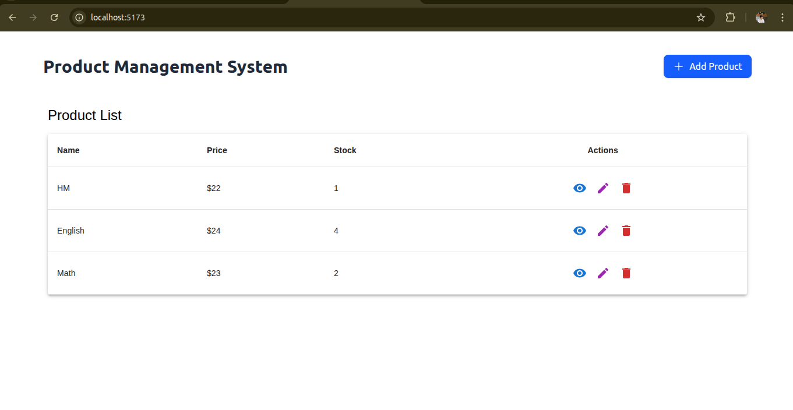
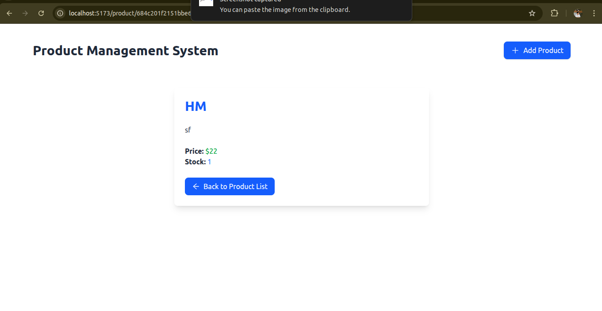
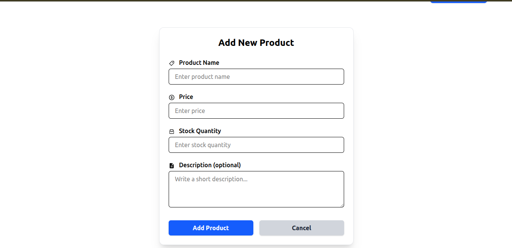

# Product-Managment-system-PMS-
**first command for both frontend and backend is**
* npm install
# for frontend
* npm run dev
# for backend
* nodemon src/index.js
* 

 
 
 
 
  
  
  
   
 
 
 
 
